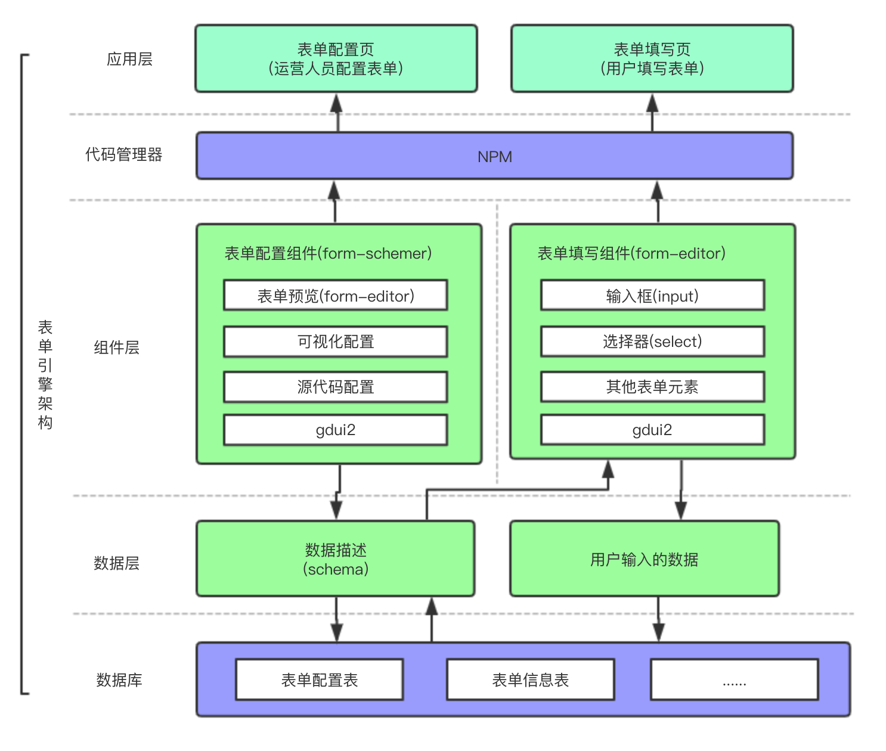

# 介绍
form-engine基于vue+gdui2, 可解决各种各样的表单需求, 编程中使用form-editor来实现表单需求, 代码量可减少60%左右



## form-editor
实现用schema(表单描述数据)来配置表单

## form-schemer
实现schema配置的可视

## 进入开发

### 第1步: 安装依赖
```bash
npm i @soneway/form-engine
```

### 第2步: 引入gdui2
由于form-engine基于gdui2, 需要引入gdui2, 详情参考: [gdui2文档](https://soneway.github.io/gdui2/docs-dist/guide/start.html)

### 第3步: js中注册组件
```javascript
import Vue from 'vue';
import formEngine from '@soneway/form-engine';
Vue.use(formEngine);
```

### 第4步: less中引用样式
```less
@import "~@soneway/form-engine/dist/css/index.css";
```

### 第5步: html中使用组件
```html
<form-editor></form-editor>
```

详情请参考: [form-engine文档](https://soneway.github.io/form-engine/docs-dist/guide/start.html)
